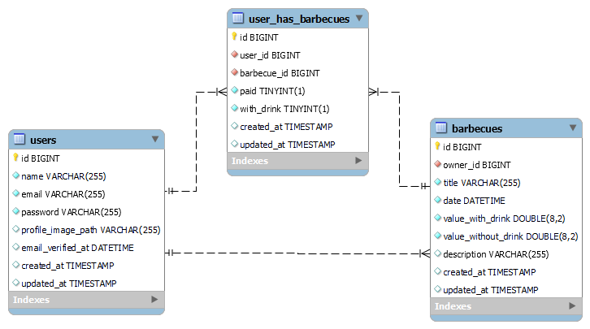

# Barbecue-Api


<p>
  
  
  
  
  
  
</p>

This API was developed with the aim of registering and controlling barbecues.  
In this API must be possible:

- Create, Read, Update and Delete Users
- Create, Read, Update and Delete Barbecues
- Authenticate registered Users
    
That API must serve [This](https://trinca-frontend-test.vercel.app/) FrontEnd application from [Icaro Apolo](https://github.com/IcaroApoloBR)

Link for [Api Documentation](https://documenter.getpostman.com/view/28170394/2s9YRCXrdA)

## Sumary

- [Barbecue-Api](#barbecue-api)
  - [Sumary](#sumary)
  - [Database](#database)
  - [config](#config)
  - [Tools](#tools)

## Database

 

## config

Create the `.env` file based on `.env.example` file.

```bash
 composer install #to install project dependencies
```

```bash
 php artisan migrate --seed #to run database migrations and seed the database with fake data
```
```bash
 php artisan storage:link #to create a symlink to storage folder
```

```bash
 php artisan serve #to start development server
```


## Tools

 - [PHP](https://www.php.net/docs.php)
 - [Composer](https://getcomposer.org/)
 - [Laravel](https://laravel.com/)


<br>

---

Developed By [Alessandro Massarotti Jr](https://github.com/alessandro-massarotti-jr) 🤖